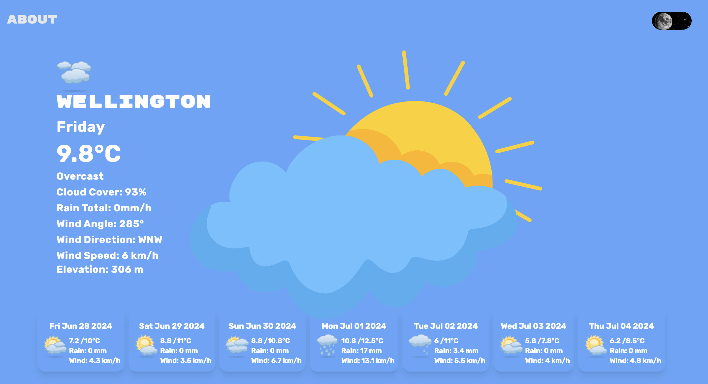
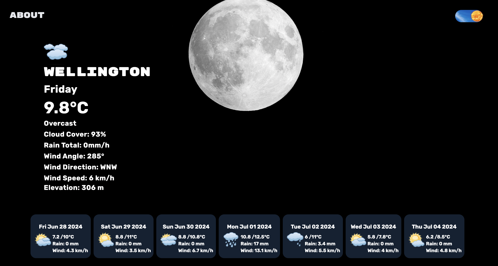

# Weather forcast app
This weather application provides real-time and forecasted weather data. The backend is built with Express, handling data fetching and serving it to the frontend. The application retrieves weather data from external APIs using superagent.

The frontend leverages React for building the user interface, with TypeScript for type safety. Styling is managed with Tailwind CSS, and the application integrates tanstack/react-query for efficient server state management and data fetching.
#
### Tech Used:

* React
* Express
* TypeScript
* Tailwind CSS
* tanstack/react-query
* superagent
* react-spinners
#

